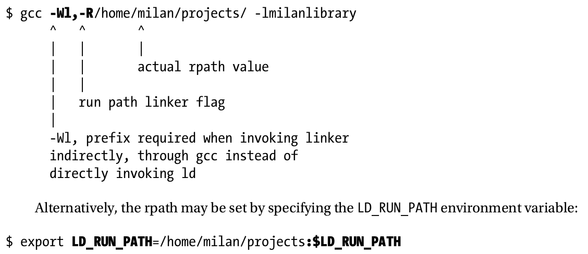

# Advanced_C_and_C++Compiling
## Multitasking OS Basics
### Memory Hierarchy and Caching Strategy

### Process Memory Division Scheme

- **Code section** carrying the machine code instructions for the CPU to execute(**.text** section)
- **Data sections** carrying the data on which the CPU while operate.
	* initialized data(**.data** section)
	* uninitialized data(**.bss** section)
	* constant data(**.rdata** section)
- The **heap** on which the dynamic memeory allocation is run.
- The **stack**, which is used to provide independent space for functions.
- The topmost part belong to the kernel.

### The Roles of Binaries, Compiler, Linker, and Loader
- The skeletion of a binary file is created by the linker.In order to compelete its task, the linker combines the binary files created by the compiler in order to fill out the variety of memory map sections(code,data,etc.).
- The task of initial creation of the process memory map is performed by the system uility called the program loader. In the simplest sense, the loader opens the binary executable file, reads the information related to the sections, and populates the process memory map structure.

## Simple Program Lifetime Stages
### The Stagges of Compiling
#### Preprocessing
- Includes the files containing definitions(include/header files) into the source files, as specified by the #include keyword
- Converts the values specified by using #define statements into the constants.
- Converts the macro definitions into code at the variety of locations in which the macros are invoked.
- Conditionally includes or excludes certain parts of the code, based on the position of #if,#elif and #endif directives.
- gcc -E input-file -o output-preprocessed-file.i
- gcc -E -P input-file -o output-preprocessed-file.i

#### Linguistic Analysis
- **Lexical analysis**, which breaks the source code into non-divisible tokens.
- **Parsing/syntax analysis** concatenates the extracted tokens into the chains of takens, and verifies that their ordering makes sense from the standpoint of programming language rules.
- **Semantic analysis** is run with the intent to discover whether the syntactically correct statements actually make any sense.

#### Compiling
- In this stage, the compiler tries to convert the standard language constructs into the constructs specific to the actual CPU instruction set.
- gcc -S input-file -o output-assembler-file.s
- In the particular case of the X86 processor architecture, the assembler code may conform to one of the two supported instruction printing formats,
	* AT&T format
	* Intel format
- AT&T Assembly Format Example
	* gcc -S -masm=att input-file -o output-file.s
- Intel Assembly Format Example
	* gcc -S -masm=intel input-file -o output-file.s
- **objdump** specializes in disassembling the binary files.

#### Compilation Process Limitations

## Work with Static Libraries
### Creating Static Library
#### Creating Linux Static Library
- On Linux, the archiver tool, called simply **ar**, is available as part of GCC toolchain.
- gcc -c first.c second.c
- ar rcs libstaticlib.a first.o second.o
- By Linux convention, static libraries names start with prefix lib and have the file extension .a

#### Converting Static to Dynamic Library
- Use the archiver(ar) tool to extract all the object files from the library.
- ar -x static-library.a
- Build the dynamic library from the set of the extracted object files to the linker.

#### Specific Rules of Linking Static Libraries
- Linking static libraries happens squentially, one static library by one.
- Linking static libraries starts from the last static library on the list of static libraries passed to the linker, and goes backwards, toward the first library on the list.
- The linker searches the static libraries in detail, and of all the object files contained in the static library it links in only the object file, which contains symbols that are really needed by client binary.

## Designing Dynamic Libraries: Basics
### Creating the Dynamic Library
#### Creating the Dynamic Library in Linux
- -fPIC compiler flag
- -shared linker flag
- gcc -fPIC -c first.c second.c
- gcc -shared first.o second.o -o libdynamiclib.so
- By Linux convention, dynamic libraries start with the prefix lib and have the filename extension .so

#### About the -fPIC Compiler Flag
##### What does -fPIC stand for?
- The "PIC" in -fPIC is the acronym for **position-independent code**.Before the concept of position-independent code came to prominence,it was possible to create dynamic libraries that the loader was capable of loading into the process memory space.However,only the process that first loaded the dynamic library could enjoy the benefits of its presence; all other running processes that needed to load the same dynamic library had no choice other than loading another copy of the same dynamic library into memory.
- Upon loading the dynamic library into the process, the loader altered the dynamic library's code(**.text**) segment in a way that made all the dynamic library's symbols meaningful solely within the realm of the process that loaded the library.This original loader design approach is known as **load-time relocation** and will be discussed in greater detail in subsequent paragraphs.
- The PIC concept was clearly a huge step ahead.By redesigning the loading mechanism to avoid tring the loaded library's code(**.text**) segment to the memory map of the first process that loaded it,the desired extra functionality notch was achieved by providing the way for multiple processes to seamlessly map to its memory map the already loaded dynamic library.

##### Is the use of the -fPIC compiler flag strictly required to build the dynamic library?
- On 32-bit architecture(X86), it is not required.If not specified, however, the dynamic library will conform to the older load-time relocation loading mechanism in which only the process that loads the dynamic library first will be able to map it into its process memory map.
- On 64-bit architecture(X86_64 and I686), the simple omission of the -fPIC compiler flag(in an attempt to implement the load-time relocation mechanism) will result with the linker error.The remedy for this kind of situation is to pass either the **-fPIC** or **-mcmodel=large** to the compile.

##### Is the use of the -fPIC compiler flag strictly confined to the domain of dynamic libraries? Can it be used when building the static library?
- On 32-bit architecture(X86),it does not really matter if you compile the static library with -fPIC flag or not.
- On 64-bit architecture(X86_64),things are even more interesting.
	* The static library linked into the executable may be compiled with or without the -fPIC compiler flag.
	* The static library linked into the dynamic library must be compiled with **-fPIC** or **mcmodel=large** flag. If the static library was not compilerd with either of the two flags, the attempt to link it in into the dynamic library results in the linker error.

#### The Symbol Export Control at Build Time
##### Method 1(affecting the whole body of code)
- -fvisibility compiler flag
- -fvisibility=hidden compiler flag it is possible to make every dynamic library symbol un-exported/invisible to whoever tries to dynamically link against the dynamic library.

##### Method 2(affecting individual symbols only)
- __attribute__((visiblity("default"|"hidden")))

##### Method 3(affecting individual symbols or a group of symbols)
- \#pragma visibility [push | pop]
- This option is typically used in the header files.
- \#pragma visibility push(hidden)
  void func1();
  void func2();
  \#pragma visibility pop

#### Dynamic Linking Modes
- The decision to link the dynamic library may be made at different stages of the program life cycle.In some scenarios,you know up front that your client binary will need to load certain dynamic library no matter what.In other scenarios,the decision about loading certain dynamic library comes as the result of runtime circumstances, or user preferences set at runtime.

## Locating the Libraries
### Linux Static Library Naming Conventions
- static library filename = lib + "library name" + .a

### Dynamic Library Filename vs. Library Name
- dynamic library filename = lib + "library name" + .so + "library version infomation"

#### Dynamic Library Version Information
- dynamic library version information = "M"."m"."p"
	* M: major version
	* m: minor version
	* p: patch(minor code change) version

#### Dynamic Library Soname(Short for shared object name)
- library soname = lib + "library name" + .so + "library major version digit(s)"
- The library soname is typically embedded by the linker into the dedicated ELF field of the library's binary file. The string specifying the library soname is typically passed to the linker through the dedicated linker flag, like so:
- gcc -shared "list of object files" **-Wl,-soname,**libfoo.so.1 -o libfoo.so.1.0.0
- readelf -d /dynamic-library-name

#### Linux Build Time Library Location Rules Details
- Break the complete library path into two parts: the folder path and the library filename.
- Pass the folder path to the linker by appending it after the **-L** Linker flag.
- Pass the library name(link name) only to linker by appending it after the **-l** flag.
- gcc main.o **-L**../sharedLib **-l**workingdemo -o demo
- In the cases when the gcc line combines compiling with linking, these linker flags should be prepended with the **-Wl**, flag, like so:
- gcc -Wall -fPIC main.cpp **-Wl,-L**../sharedLib -**-Wl,-lworkingdemo** -o demo

#### Beginners' Mistakes: What Can Possibly Go Wrong and How to Avoid It
- The typicl problems happen to the impatient and inexperienced programmer in scearios dealing with dynamic libraries, when either of the following situations happend:
	* The full path to a dynamic library is passed to the **-l** option(**-L** part being not used).
	* The part of the path is passed through the **-L** option, and the rest of the path including the filename passed through the **-l** option.

- The linker usually formally accepts these variations of specifying the build time library paths. In the case when the path to static libraries is provided, these kinds of "creative freedoms" do not cause problems down the road.However, when the path to the dynamic library is passed, the problems introduced by deviating from the truly correct way of passing the library path start showing up at runtime.
- gcc main.o -l/home/milan/mylibs/case_a/libmilan.so -o demo

### Runtime Dynamic Library Location Rules
#### Linux Runtime Dynamic Library Location Rules
##### Preloaded Libraries
- The unquestionable highest priority above any library search is reserved for the libraries specified for preloading, as the loader first loads these libraries.
	* By setting the **LD_PRELOAD** environment variable.
	  export **LD_PRELOAD**=/home/milan/project/libs/libmilan.so:**$LD_PRELOAD**
    * Through the **/etc/ld.so.preload** file.

##### rpath

##### ldconfig Cache
- Running the ldconfig utility is usually one of the last steps during the standard package installation procedure, which typically requires passing the path to a folder containing libraries as input argument. The result is that ldconfig inserts the specified folder path to the list of dynamic library search folders maintained in the /etc/ld.so.conf file. At the same token, the newly added folder path is scanned for dynamic libraries, the result of which is that the filenames of found libraries get added to the list of libraries’ filenames maintained in the /etc/ld.so.cache file.

##### The Default Library Paths(/lib and /usr/lib)
- The paths /lib and /usr/lib are the two default locations where Linux OS keeps its dynamic libraries. The third party programs designed to be used with superuser privileges and/or to be available to all users typically deploy their dynamic library into one of these two places. Please notice that the path /usr/local/lib does not belong to this category.

##### Priority Scheme Summary
- When RUNPATH field is specified (i.e. DT_RUNPATH is non-empty)
	* LD_LIBRARY_PATH
	* runpath (DT_RUNPATH field)
	* ld.so.cache
	* default library paths (/lib and /usr/lib)

- In the absence of RUNPATH (i.e. DT_RUNPATH is empty string)
	* RPATH of the loaded binary, followed by the RPATH of the binary, which loads it all the way up to either the executable or the dynamic library which loads all of them
	* LD_LIBRARY_PATH
	* ld.so.cache
	* default library paths (/lib and /usr/lib)

#### Windows Runtime Dynamic Library Location Rules
- The very same path in which the application binary file resides
- One of the system DLL folders (such as C:\Windows\System or C:\Windows\System32)

## Designing Dynamic Libraries:Advanced Topics
- A crucial factor in this process is the memory mapping concept, Basically, it allows a dynamic library that is already loaded in the memory map of a running process to be mapped into the memory map of another process running concurrently.
- The important rule of dynamic linking is that different processes do share the code segment of the dynamic library, but do not share the data segments.Each of the processes loading the dynamic library is expected to provide its own copy of the data on which the dynamic library code operates (i.e., the library’s data segment).

### Why Resolved Memory Addresses Are a Must
- Certain groups of instructions expect that the address of the operand in memory be know at runtime,In general, the following two groups of instructions strictly require the precisely calculated addresses:
	* Data access instructions(mov, etc)require the address of the operand in memory.
	* Subrouting calls(call, jmp,etc)require the address of function in code segment.

## Handling Duplicate Symbols When Linking In Dynamic Libraries
