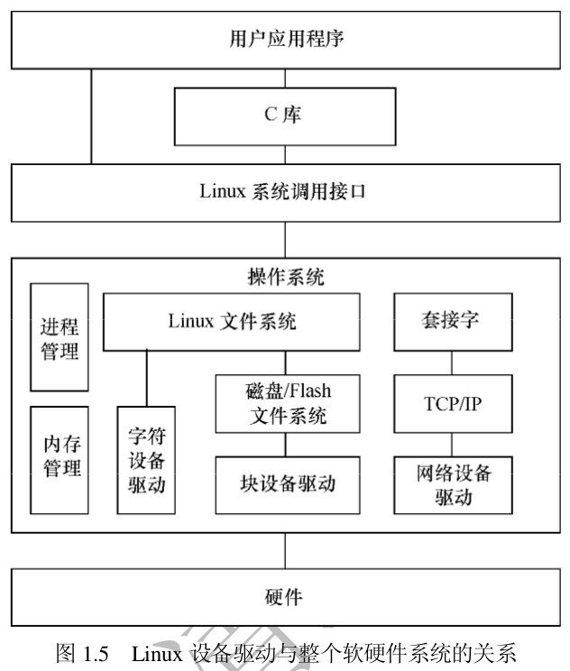

Linux设备驱动开发详解_宋宝华

### Linux设备驱动概述
#### 1. 设备的分类及特点
---
- Linux将存储器和外设分为3个基础大类：
	1. 字符设备
	2. 块设备
	3. 网络设备
- 字符设备：指那些必须以串行顺序依次访问的设备，例如鼠标等待
- 块设备：可以用任意顺序进行访问，以块为单位进行操作，如硬盘等待。
- 字符设备不经过系统的快速缓冲，而块设备经过系统的快速缓冲，字符设备和块设备的驱动设计呈现很大的差异，但是对于用户而言，他们都使用文件系统的操作接口open()、close()、read()、write()等函数进行访问。
---

#### 2. Linux设备驱动与整个软硬件系统的关系
---
- 应用程序可以使用 Linux 的系统调用接口编程,也可以使用 C 库函数,出于代码可移植性的考虑,后者更值得推荐。C 库函数本身也通过系统调用接口而实现,如 C库函数中的 fopen()、fwrite()、fread()、fclose()分别会调用操作系统 API 的 open()、write()、read()、close()函数。

---

### 3. 驱动设计的硬件基础
#### 1. 处理器
---
* 通用处理器(GPP)
	- 嵌入式微控制器(MCU)
	- 微处理器(MPU)
- MPU 通常代表一个 CPU(中央处理器),而 MCU 则强调把中央处理器、存储器和外围电路集成在一个芯片中。早期,微控制器被称为单片机,意思是把计算机集成在一个芯片内。
- MCU嵌入式微控制器也常被称作片上系统(SoC),含义是在一个芯片上设计了整个系统。
---
#### GPIO介绍
---
- GPIO：GPIO 一般由两组寄存器控制,即一组控制寄存器和一组数据寄存器。控制寄存器可设置 GPIO 口的工作方式为输入或输出。当引脚被设置为输出时,向数据寄存器的对应位写入 1 和 0 会分别在引脚上产生高电平和低电平;当引脚设置为输入时,读取数据寄存器的对应位可获得引脚上相应的电平信号。

---

