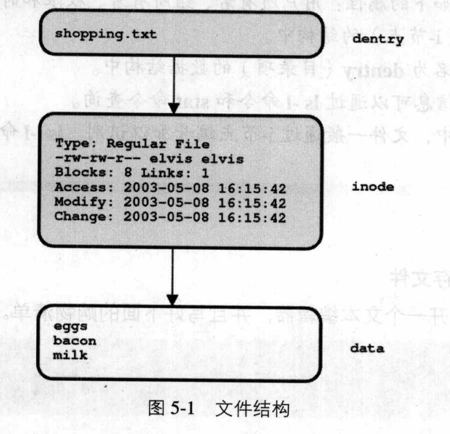
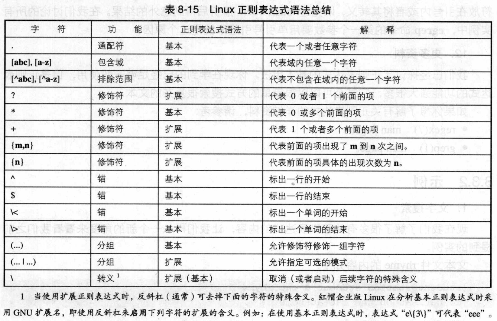

[目录]

[TOC "float:left"]

### 使用who命令判断谁在系统上
___
- tty1和tty2分别指虚拟控制台1和2
- :0指的是X服务器本身
- pts/0指的是X服务器中打开的第一个终端
___

###Linux终端控制组合键
___
| 组合键 | 符号名称 | 约定使用 |
|:-------:|:---------:|:---------|
|Ctrl + C | SIGINT | 非常规中断-终止前台进程|
|Ctrl + D | EOT    | 输入完成的正常信号|
|Ctrl + G | BEL    | 终端生效   |
|Ctrl + H | BS     | 后退一格-删除前一个字符|
|Ctrl+ L | FF | 换页--是bash清屏|
|Ctrl + Q | | 解锁终端显示|
|Ctrl + S | | 锁住终端显示|
|Ctrl + U | NAK | 删除当前的行|
|Ctrl + Z | SIGSTOP | 挂起前台进程 |
|Ctrl + A| |移动光标到行首|
|Ctrl + E| |移动光标到行尾|
||||

- wc命令在没有给出文件名作为参数的情况下，会对用户从键盘输入的行、词和字符进行计数，用户使用组合键Ctrl+D表示输入结束，wc会报告3个数字分别是行数、单词个数和字符个数。
- Ctrl + Z用来挂起程序，挂起的程序可用fg(foreground)命令恢复。
___
### 终端设备名称
___
| 名称 | 设备 | 使用 |
|-----|:------:|------|
|ttyn|虚拟控制台|使用Ctrl+Alt+Fn组合键访问|
|ttySn|串口端口设备|连接到串行端口上的调制解调器或VT100类型。UNIX中的ttyS0等于DOS中的COM1，ttyS1等于DOS中的COM2，依次类推。|
|pts/n|伪终端|一个模拟终端，经常被X图像环境中终端窗口或起始于网络的Shell(如telent和ssh)使用。|
|:0|X服务器|X服务器并不是真正的终端。当用户使用X图形环境的登陆管理器登陆时，其终端经常被列为X服务器本身.|
___
### 获取帮助
___
- 分页程序++less++：使用空格键浏览下一页，b键回到上一页，q键退出，b键浏览上一页，/textEnter搜索文件text,n查找之前用过的搜索术语的下一个出现位置，?textEnter向前搜索文本，Nn查找之前用过的搜索术语的下一个出现位置。
- ==man== 每章都包括一个叫intro的介绍页，所以命令man 5 intro可查看第5章的介绍页。
- 经常和man命令同是使用的俩个选项是：进行关键词搜索的-k选项和浏览参数的"所有相关"页的-a选项。例如：man -k passwd
- ==yelp==：GNOME帮助浏览器
___
### 目录管理
___
* 在默认状态下，如果父目录不存在，mkdir命令不能为其建立子目录：使用mkdir -p(parent)命令，可以一次建立整个目录树。
* 列表显示目录树：ls -R
___
### 检查文件
___
- ==file==判断文件类型。
- ==more/less==浏览文件
- ==head== 浏览文件的最前面的几行
- ==tail== 浏览文件的最后10行的内容
- ==tail -f== 用于实时的监控文件内容的变化
___
### 检查用户
___
- ==id== 命令来确定用户的成员身份信息
- ==whoami== 报告当前用户的用户名
- 当前登陆的用户:==users==、==w==和==who==
- 调查用户==finger==命令
___
### 常规文件和目录的权限
___
| | (r)读 | (w)写 | (x)可执行|
|--|-----|-------|----------|
|常规文件| 浏览文件| 修改文件| 将文件作为命令|
|目录|列出目录内容| 添加或删除文件| 在目录中搜索已知文件|
___
### 控制默认权限
___
- 在内核级别，Linux使用默认模式666(rw-rw-rw)建立文件
- 在内核级别，Linux使用默认模式777(rwxrwxrwx)建立目录
- 每个进程都使用一个"umask"参数来遮盖某些特定的默认权限
- 在红帽企业版Linux中，标准用户的默认umask值002
- 用umask命令可修改bash Shell的umask值

**==文件的默认权限==**
```[C++]
kernel default:        666 --> rw-rw-rw-
umask:                 002 --> -------w-
------------------------------------------
default permissions:   664 --> rw-rw-r--
```
**==目录的默认权限==**
```[java]
kernel default:        777 --> rwrwxrwx
umask:                 002 --> -------w-
------------------------------------------
default permissions:   775 --> rwxrwxr-x
```
- 使用~/.bashrc自动更改bash Shell的umask，当一个新的bash启动时，文件~/.bashrc中的命令自动执行，就像在命令行输入这些命令一样。
___
### Linux 文件系统
___
**元数据**
在Linux系统中，每个文件除了内容之外，都有一些相关信息，即用户所有者、组所有者和权限。同时页保存了其他信息，如文件被最后一次修改或阅读的时间。当执行ls -l命令时，大多数此类的元数据就显示出来。在Linux系统中，所有与某个文件相关的额外信息都保存在一个叫inode(i-节点)的结构中。
**文件名**
尽管文件名也可以被称为与文件相关的元数据，它却是上述原则的例外，因为文件不直接保存在i节点中，相反，文件名保存在名为dentry(目录项)的结构中。dentry是directory entry的缩写，实质上，该文件名把一个文件的名称和一个inode关联在一起。


**Linux文件类型**

| 文件类型 | ls缩写 | 应用 |
|---------|-------|-----|
|常规文件|-|保存数据|
|目录|d|存放文件|
|符号连接|l|指向其他文件|
|字符设备节点|c|访问设设备|
|块设备节点|b|访问设备|
|命名管道函数|p|进程间通信|
|套接字|s|进程间通信|
**时间信息**

|缩写|名称|目的|
|---|----|---|
|atime|访问时间|文件数据每次被阅读后的更新|
|mtime|修改时间|文件数据每次被改变后的更新|
|ctime|改变时间|文件的i-节点信息每次被改变后都更新|
- 改变(change)和修改(modify)不同处是：当一个文件的数据改变时，就说该文件被修改了，mtime得到更新。当一个文件的i-节点改变时，就说该文件被改变了，ctime得到跟新。修改一个文件(改变mtime)也引起ctime的更新。

**文件长度和大小**
- i-节点用两种度量记录文件大小：文件的长度(即文件数据的实际字节数)和大小(即所占用的磁盘空间量)。一般来说，文件的大小每次以字节块(通常是4千字节)为单位增加，而文件数据增加时，其长度以单个字节伪单位递增。而使用ls -l命令时，显示文件__长度__。当使用ls -s命令时，显示的是文件__大小__
- ls -dl 显示文件夹的详细信息。
- ls -t 命令行选项按mtime顺序排列。
- ls -r 命令行选项按倒序排列。
___

### 软连接和硬链接
___
**硬链接和软连接的比较**

|硬链接|软连接|
|-----|-----|
|目录之间不能用硬链接|软连接可以关联mul|
|硬链接没有原始文件和复制文件的概念。硬链接一旦创建它连接的两端都是同等待遇|软连接有引用和被引用的概念。删除被引用的文件就导致空连接的产生|
|硬链接必须关联同一个文件系统下的文件|软连接也可以关联不同文件系统(分区)中的文件|
|chroot的目录间可以共享硬链接|软连接不能引用chroot目录外的文件|
___

### Bash Shell
**bash历史记录的替换**
___
|语法|替换|
|----|---|
|!!|前一个命令|
|!n|命令号n|
|!-n|倒数第n个命令|
|！cmd|最后用来启动cmd的命令|
**bash Shell提供的访问命令历史记录的技巧**
- **ESC+.和Alt+.**
  之前被输入的命令行的最后一个标记可以用上面提到的俩个组合键中的任何一个来恢复，例如：创建一个目录，然后立即用cd命令进入该目录。
- **Ctrl+R**
  这个组合键实质上模仿了!cmd。在Ctrl+R组合键之后键入的文本与之前键入的命令相匹配，随着文本的键入而立即被看到。
- **~fc~**

**禁止命令历史记录**
- rm .bash_history
- ln -s /dev/null .bash_history

**运行多个命令**
bash Shell通过使用;隔开命令，让用户在一个命令行中输入多个命令。
**在子Shell中运行命令**
bash Shell可以通过将命令括在括号里允许用户在子Shell中简便地运行命令。例如：(cd /etc/; ls),这样的好处是不会对当前shell的属性进行修改。

**bash取消变量**命令是unset varName

**只读变量**

|变量|含义|
|---|----|
|?|最新执行的命令的退出状态|
|$|当前Shell的进程id|
|PPID|Shell父进程的进程id|
|UID|当前用户的用户id|

**bash预赋值的变量**

|变量|含义|
|---|----|
|BASH_VERSION|当前bash的版本|
|HOSTNAME|当前机器的DNS主机名|
|OLDPWD|上一次工作目录|
|PWD|当前工作目录|
|RANDOM|介于0到32767之间的任意整数|
|SECONDS|自Shell启动以来的秒数|

- 使用export将变量提升为一个环境变量，这个变量将会被传给未来的子进程
- 用set命令和env命令查看变量

**命令行替换**

|替换|语法|含义|
|----|---|---|
|历史|!|前一个命令行|
|大括号|{}|指定的文本|
|带字号|~username|用户的主目录|
|变量|$,${...}|Shell和环境变量|
|算术|$((...))|算术运算(只支持整数运算)|
|命令替换|`...`,$(...)|运行在子Shell中的命令的输出|
|路径名|*,?,[...],[^...]|文件系统中的匹配的文件名|

- 大括号替换把一个单词展开为多个单词，一次一个，循环替换"大括号中"的元素。表达式{c,b,r}at会替换为三个单词cat bat rat。例如：mkdir chap{01,02,03,04}/{html,text}

**bash Shell的引用和转义**

|语法|作用|
|---|----|
|\|避免下一个字符被Shell解释|
|"..."|避免双引号内除了$,!和`(反引号)字符以外的其他字符被Shell解释|
|'...'|避免单引号内的字符被Shell解释|

- find /etc -name *.conf bash首先要做的是：检查了本地目录，并且在发现了文件a.conf和b.conf之后，Shell用匹配的文件名a.conf和b.conf取代了匹配模式*.conf。命令就变成这个样子：find /etc -name a.conf b.conf这样就产生了一个错误。
___

### 获得Shell脚本和Shell初始化
___
**获得脚本**
source + script_name 或者 . + script_name
**bash初始化**
登录与非登录Shell、交互式与非交互式Shell
**不同类型的bash Shell**

|上下文|登录Shell|交互式Shell|
|-----|--------|-----------|
|从虚拟控制台登录Shell|是|是|
|通过网络Shell到一台远程机器上时登录Shell|是|是|
|X初始化Shell|是|是|
|X终端Shell|否|是|
|手动运行bash启动的子Shell|否|是|
|用在命令替换中的子Shell|否|否|
|被圆括号分组的命令使用的子Shell|否|否|
|执行脚本时使用的子Shell|否|否|

**bash的启动配置文件**

|文件|Shell类型|预期功能|
|----|--------|-------|
|/etc/profile|登录Shell|通用的有效环境变量|
|/etc/profile.d/*.sh|登录Shell|软件包特有的环境变量|
|~/.bash_profile|登录Shell|用户特有的环境变量|
|~/.bashrc|所有交互式Shell|用户特有的别名、SHell功能和Shell选项|
|/etc/bashrc|所有交互式Shell|通用别名、Shell功能和Shell选项|
___

### bash重定向标准输入、标准输出和标准错误
|语法|作用|
|----|---|
|cmd < file|从file重定向标准输入|
|cmd > file|把标准输出重定向到file中，如果file存在的话，覆盖它|
|cmd >> file|把标准输出重定向到file中，如果file存在，附加给它|
|cmd 2> file|把标准错误重定向到file，如果file存在，覆盖它|
|cmd 2>> file|把标准错误重定向到file中，如果file存在，附加给它|
|cmd > file 2>&1|合并标准输出和标准错误，并且重定向到file中|
|cmd >& file|合并标准输出和标准错误，并且重定向到file中|



**bash Shell中的作业管理**

|命令|行为|
|---|----|
|jobs|列出所有作业|
|fg[N]|把后台作业N置于前台|
|Ctrl+Z|挂起当前前台命令，并将其置于后台|
|bg[N]|启动挂起的后台作业N|
|kill %N|终止后台作业N|

- 把在前台运行的命令置于后台运行，在命令的结尾加__&__符合

###网络应用程序
