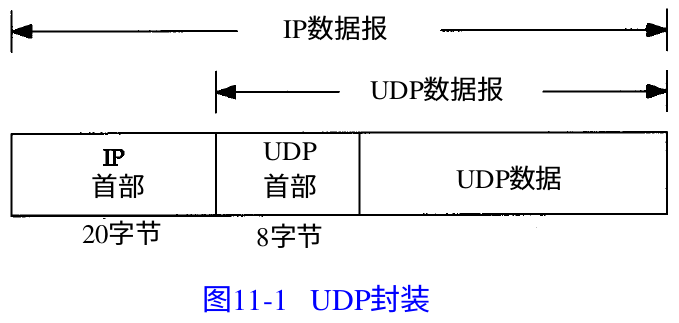

[TOC]
## TCP-IP详解卷一
### 概述
#### IP协议族分层

- 链路层,有时也称作数据链路层或网络接口层,通常包括操作系统中的设备驱动程序和计算机中对应的网络接口卡。
- 网络层,有时也称作互联网层,处理分组在网络中的活动,例如分组的选路。在TCP/IP协议族中,网络层协议包括IP(网际协议),ICMP协议(Internet互联网控制报文协议),以及IGMP协议(Internet组管理协议)。
- 运输层主要为两台主机上的应用程序提供端到端的通信。在 TCP/IP协议族中,有两个互不相同的传输协议:TCP(传输控制协议)和UDP(用户数据报协议)。
- 应用层负责处理特定的应用程序细节。例如:
	* Telnet远程登录
	* FTP文件传输协议
	* SMTP简单邮件传输协议
	* SNMP简单网络管理协议

- ICMP是IP协议的附属协议。IP层用它来与其他主机或路由器交换错误报文和其他重要信息。尽管ICMP主要被IP使用,但应用程序也有可能访问它。我们将分析两个流行的诊断工具,Ping和Traceroute,它们都使用了ICMP。
- IGMP是Internet组管理协议。它用来把一个UDP数据报多播到多个主机。
- ARP(地址解析协议)和RARP(逆地址解析协议)是某些网络接口(如以太网和令牌环网)使用的特殊协议,用来转换IP层和网络接口层使用的地址。

#### 互联就地址

#### 封装

#### 分用

- 为协议ICMP和IGMP定位一直是一件很棘手的事情。在图 1-4中,把它们与IP放在同一层上,那是因为事实上它们是IP的附属协议。但是在这里,我们又把它们放在IP层的上面,这是因为ICMP和IGMP报文都被封装在IP数据报中。

#### 端口
- TCP和UDP采用16 bit的端口号来识别应用程序。
	* FTP服务器的TCP端口号都是21。
	* 每个Telnet服务器的TCP端口号都是23。
	* 每个TFTP(简单文件传送协议)服务器的UDP端口号都是69。
- 知名端口号介于1~255之间。256~1023之间的端口号通常都是由Unix系统占用,以提供一些特定的Unix服务—也就是说,提供一些只有Unix系统才有的、而其他操作系统可能不提供的服务。
- 大多数TCP/IP实现给临时端口分配1024~5000之间的端口号。

### 链路层
- TCP/IP协议族中，连接层主要有三个目的：
	* 为IP模块发送和接收I P数据报;
	* 为ARP模块发送ARP请求和接收ARP应答;
	* 为RARP发送RARP请求和接收RARP应答。

#### 环回接口
- 大多数的产品都支持环回接口(Loopback Interface),以允许运行在同一台主机上的客户程序和服务器程序通过TCP/IP进行通信。A类网络号127就是为环回接口预留的。根据惯例,大多数系统把IP地址127.0.0.1分配给这个接口,并命名为localhost。一个传给环回接口的IP数据报不能在任何网络上出现。
- TCP/IP支持多种不同的链路层协议,这取决于网络所使用的硬件,如以太网、令牌环网、FDDI(光纤分布式数据接口)及RS-232串行线路等。

#### 最大传输单元MTU
- 每种网络的MTU都不同。
- 如果IP层有一个数据报要传,而且数据的长度比链路层的MTU还大,那么IP层络超通道以太网就需要进行分片(fragmentation),把数据报分成若干片,这样每一片都小于MTU。

### IP:	网际协议
- IP是TCP/IP协议族中最为核心的协议。所有的TCP、UDP、ICMP及IGMP数据都以IP数据报格式传输。
- TCP/IP的人对IP提供不可靠、无连接的数据报。
	* 不可靠(unreliable)的意思是它不能保证IP数据报能成功地到达目的地。IP仅提供最好的传输服务。如果发生某种错误时,如某个路由器暂时用完了缓冲区, IP有一个简单的错误处理算法:丢弃该数据报,然后发送ICMP消息报给信源端。任何要求的可靠性必须由上层来提供(如TCP)。
	* 无连接(connectionless)这个术语的意思是IP并不维护任何关于后续数据报的状态信息。每个数据报的处理是相互独立的。这也说明, IP数据报可以不按发送顺序接收。如果一信源向相同的信宿发送两个连续的数据报(先是A,然后是B),每个数据报都是独立地进行路由选择,可能选择不同的路线,因此 B可能在A到达之前先到达。

#### IP首部

-目前的协议版本号是4,因此I P有时也称作IPv4。
- 首部长度指的是首部占32 bit字的数目,包括任何选项。由于它是一个4比特字段,因此首部最长为60(15*4)个字节。
- 服务类型(TOS)字段包括一个3 bit的优先权子字段(现在已被忽略),4 bit的TOS子字段和1 bit未用位但必须置 0。4 bit的TOS分别代表:最小时延、最大吞吐量、最高可靠性和最小费用。4 bit中只能置其中1 bit。如果所有4 bit均为0,那么就意味着是一般服务。
- 总长度字段是指整个IP数据报的长度,以字节为单位。利用首部长度字段和总长度字段,就可以知道IP数据报中数据内容的起始位置和长度。由于该字段长16比特,所以IP数据报最长可达65535字节(超级通道的MTU为65535。它的意思其实不是一个真正的MTU — 它使用了最长的IP数据报)。当数据报被分片时,该字段的值也随着变化。
- TTL(time-to-live)生存时间字段设置了数据报可以经过的最多路由器数。它指定了数据报的生存时间。TTL的初始值由源主机设置(通常为32或64),一旦经过一个处理它的路由器,它的值就减去1。当该字段的值为0时,数据报就被丢弃,并发送ICMP报文通知源主机。
- 首部检验和字段是根据 I P首部计算的检验和码。它不对首部后面的数据进行计算。ICMP、IGMP、UDP和TCP在它们各自的首部中均含有同时覆盖首部和数据检验和码。为了计算一份数据报的IP检验和,首先把检验和字段置为 0。然后,对首部中每个16 bit进行二进制反码求和(整个首部看成是由一串16 bit的字组成),结果存在检验和字段中。当收到一份IP数据报后,同样对首部中每个16 bit进行二进制反码的求和。由于接收方在计算过程中包含了发送方存在首部中的检验和,因此,如果首部在传输过程中没有发生任何差错,那么接收方计算的结果应该为全1。如果结果不是全 1(即检验和错误),那么IP就丢弃收到的数据报。

#### 子网寻址
- 不是把IP地址看成由单纯的一个网络号和一个主机号组成,而是把主机号再分成一个子网号和一个主机号。这样做的原因是因为 A类和B类地址为主机号分配了太多的空间,可分别容纳的主机数为2^24-2和2^16-2。事实上,在一个网络中人们并不安排这么多的主机。由于全0或全1的主机号都是无效的,因此我们把总数减去2。

#### 子网掩码
-除了IP地址以外,主机还需要知道有多少比特用于子网号及多少比特用于主机号。这是在引导过程中通过子网掩码来确定的。这个掩码是一个32 bit的值,其中值为1的比特留给网络号和子网号,为 0的比特留给主机号。

### ARP:地址解析协议

- 当一台主机把以太网数据帧发送到位于同一局域网上的另一台主机时,是根据48 bit的以太网地址来确定目的接口的。设备驱动程序从不检查IP数据报中的目的IP地址。
- 点对点链路不使用ARP。

#### ARP高速缓存
- 每个主机上都有一个ARP高速缓存。这个高速缓存存放了最近Internet地址到硬件地址之间的映射记录。高速缓存中每一项的生存时间一般为20分钟。
- arp -a查看缓存	

#### ARP的分组格式

- 以太网报头中的前两个字段是以太网的源地址和目的地址。目的地址为全1的特殊地址是广播地址。电缆上的所有以太网接口都要接收广播的数据帧。
- 两个字节长的以太网帧类型表示后面数据的类型。对于ARP请求或应答来说,该字段的值为0x0806。
- 操作字段指出四种操作类型,它们是ARP请求(值为1)、ARP应答(值为2)、RARP请求(值为3)和RARP应答(值为4)

#### ARP代理
- 如果ARP请求是从一个网络的主机发往另一个网络上的主机,那么连接这两个网络的路由器就可以回答该请求,这个过程称作委托ARP或ARP代理(Proxy ARP)。这样可以欺骗发起ARP请求的发送端,使它误以为路由器就是目的主机,而事实上目的主机是在路由器的“另一边”。路由器的功能相当于目的主机的代理,把分组从其他主机转发给它。

### ICMP:Internet控制报文协议

### Ping程序
- Ping程序是为了测试另一台主机是否可达。该程序发送一份ICMP回显请求报文给主机,并等待返回ICMP回显应答。

- Unix系统在实现ping程序时是把ICMP报文中的标识符字段置成发送进程的ID号。这样即使在同一台主机上同时运行了多个ping程序实例, ping程序也可以识别出返回的信息。
- 序列号从0开始,每发送一次新的回显请求就加1。
- ping程序通过在ICMP报文数据中存放发送请求的时间值来计算往返时间。当应答返回时,用当前时间减去存放在ICMP报文中的时间值,即是往返时间。
- 通常,第1个往返时间值要比其他的大。这是由于目的端的硬件地址不在ARP高速缓存的缘故。

#### IP记录路由选项
- 大多数版本的ping程序都提供-R选项，以提供记录路由的功能，它使得ping程序在发送出去的IP数据报中设置IP RR选项(该IP数据报包含ICMP回显请求报文)。这样,每个处理该数据报的路由器都把它的IP地址放入选项字段中。当数据报到达目的端时,IP地址清单应该复制到ICMP回显应答中,这返回途中所经过的路由器地址也被加入清单中。当ping程序收到回显应答时,它就打印出这份IP地址清单。但是,最大的问题是IP首部中只有有限的空间来存放IP地址。我们从图3-1可以看到,IP首部中的首部长度字段只有4 bit,因此整个IP首部最长只能包括15个32 bit长的字(即60个字节)。由于IP首部固定长度为20字节, RR选项用去3个字节(下面我们再讨论),这样只剩下37个字节( 60-20-3 )来存放IP 地址清单,也就是说只能存放9个IP地址。

### Traceroute程序
- Traceroute程序可以让我们看到IP数据报从一台主机传到另一台主机所经过的路由。

### UDP:用户数据报协议

- UDP不提供可靠性:它把应用程序传给IP层的数据发送出去,但是并不保证它们能到达目的地。

- UDP长度字段指的是UDP首部和UDP数据的字节长度。该字段的最小值为8字节(发送一份0字节的UDP数据报是OK)。
- UDP检验和覆盖UDP首部和UDP数据。回想IP首部的检验和,它只覆盖IP的首部 — 并不覆盖IP数据报中的任何数据。
- 不是所有的以太网数据帧都是IP数据报,至少以太网还要使用ARP协议。不是所有的IP数据报都是UDP或TCP数据,因为ICMP也用IP传送数据。
#### IP分片
- 物理网络层一般要限制每次发送数据帧的最大长度。任何时候IP层接收到一份要发送的IP数据报时,它要判断向本地哪个接口发送数据(选路),并查询该接口获得其MTU。IP把MTU与数据报长度进行比较,如果需要则进行分片。分片可以发生在原始发送端主机上(数据报大于原始端主机的MTU),也可以发生在中间路由器上(数据报大于新网络中的MTU)。重组装只能发生在目的主机上，重新组装由目的端的IP层来完成，已经分片过的数据报有可能会再次进行分片(可能不止一次)。
- 对于发送端发送的每份IP数据报来说,其标识字段都包含一个唯一值。该值在数据报分片时被复制到每个片中。
- 标志字段用其中一个比特来表示“更多的片”。除了最后一片外,其他每个组成数据报的片都要把该比特置1。
- 片偏移字段指的是该片偏移原始数据报开始处的位置。另外,当数据报被分片后,每个片的总长度值要改为该片的长度值。
- 当I P数据报被分片后,每一片都成为一个分组,具有自己的IP首部,并在选择路由时与其他分组独立。这样,当数据报的这些片到达目的端时有可能会失序,但是在IP首部中有足够的信息让接收端能正确组装这些数据报片。
- 尽管I P分片过程看起来是透明的,但有一点让人不想使用它:即使只丢失一片数据也要重传整个数据报。为什么会发生这种情况呢?因为IP层本身没有超时重传的机制——由更高层来负责超时和重传(TCP有超时和重传机制,但UDP没有。一些UDP应用程序本身也执行超时和重传)。当来自TCP报文段的某一片丢失后,TCP在超时后会重发整个TCP报文段,该报文段对应于一份IP数据报。没有办法只重传数据报中的一个数据报片。事实上,如果对数据报分片的是中间路由器,而不是起始端系统,那么起始端系统就无法知道数据报是如何被分片的。就这个原因,经常要避免分片。

#### 最大UDP数据报长度
- 理论上,IP数据报的最大长度是65535字节,这是由IP首部(图3 - 1)1 6比特总长度字段所限制的。去除20字节的IP首部和8个字节的UDP首部, UDP数据报中用户数据的最长长度为65507字节。但是,大多数实现所提供的长度比这个最大值小。
- 第一,应用程序可能会受到其程序接口的限制。 socket API提供了一个可供应用程序调用的函数,以设置接收和发送缓存的长度。现在的大部分系统都默认提供了可读写大于8192字节的UDP数据报。
- 第二个限制来自于TCP/IP的内核实现。

### 广播和多播
#### IP地址分类
- 单播地址
- 广播地址
- 多播地址
- 广播和多播仅应用于UDP,它们对需将报文同时传往多个接收者的应用来说十分重要。TCP是一个面向连接的协议,它意味着分别运行于两主机(由IP地址确定)内的两进程(由端口号确定)间存在一条连接。

#### 广播地址
##### 指向网络的广播
- 指向网络的广播地址是主机号为全1的地址。A类网络广播地址为netid.255.255.255,其中netid为A类网络的网络号。

##### 指向子网的广播
- 指向子网的广播地址为主机号为全 1且有特定子网号的地址。作为子网直接广播地址的IP地址需要了解子网的掩码。

##### 指向所有子网的广播
- 指向所有子网的广播也需要了解目的网络的子网掩码,以便与指向网络的广播地址区分开。指向所有子网的广播地址的子网号及主机号为全1 。例如,如果目的子网掩码为255.255.255.0,那么IP地址128.1.255.255是一个指向所有子网的广播地址。然而,如果网络没有划分子网,这就是一个指向网络的广播。

#### 多播
##### 多播组地址

- 能够接收发往一个特定多播组地址数据的主机集合称为主机组(host group)。一个主机组可跨越多个网络。主机组中成员可随时加入或离开主机组。主机组中对主机的数量没有限制,同时不属于某一主机组的主机可以向该组发送信息。
- 一些多播组地址被IANA确定为知名地址。它们也被当作永久主机组,这和TCP及UDP中的熟知端口相似。
- 224.0.0.1代表“该子网内的所有系统组”,224.0.0.2代表“该子网内的所有路由器组”。

##### 多播组地址到以太网地址的转换

### IGMP:Internet组管理协议

### DNS:域名系统
- 域名系统(DNS)是一种用于TCP/IP应用程序的分布式数据库,它提供主机名字和IP地址之间的转换及有关电子邮件的选路信息。这里提到的分布式是指在Internet上的单个站点不能拥有所有的信息。

- 每个结点(图14-1中的圆圈)有一个至多63个字符长的标识。这颗树的树根是没有任何标识的特殊结点。命名标识中一律不区分大写和小写。
- 命名树上任何一个结点的域名就是将从该结点到最高层的域名串连起来,中间使用一个点“.”分隔这些域名。
- 域名树中的每个结点必须有一个唯一的域名,但域名树中的不同结点可使用相同的标识。

#### 顶级域名被分为三个部分
- arpa是一个用作地址到名字转换的特殊域。
- 7个3字符长的普通域。有些书也将这些域称为组织域。
- 所有2字符长的域均是基于ISO3166中定义的国家代码,这些域被称为国家域,或地理域。

### TFTP:简单文件传送协议

### TCP:传输控制协议
- 尽管TCP和UDP都使用相同的网络层(IP),TCP却向应用层提供与UDP完全不同的服务。TCP提供一种面向连接的、可靠的字节流服务。

#### TCP通过下列方式来提供可靠性
- 应用数据被分割成TCP认为最适合发送的数据块。这和UDP完全不同,应用程序产生的数据报长度将保持不变。由TCP传递给IP的信息单位称为报文段或段(segment)。
- 当TCP发出一个段后,它启动一个定时器,等待目的端确认收到这个报文段。如果不能及时收到一个确认,将重发这个报文段。
- 当TCP收到发自TCP连接另一端的数据,它将发送一个确认。这个确认不是立即发送,通常将推迟几分之一秒。
- TCP将保持它首部和数据的检验和。这是一个端到端的检验和,目的是检测数据在传输过程中的任何变化。如果收到段的检验和有差错,TCP将丢弃这个报文段和不确认收到此报文段(希望发端超时并重发)。
- 既然TCP报文段作为IP数据报来传输,而IP数据报的到达可能会失序,因此TCP报文段的到达也可能会失序。如果必要, TCP将对收到的数据进行重新排序,将收到的数据以正确的顺序交给应用层。
- 既然IP数据报会发生重复,TCP的接收端必须丢弃重复的数据。
- TCP还能提供流量控制。TCP连接的每一方都有固定大小的缓冲空间。TCP的接收端只允许另一端发送接收端缓冲区所能接纳的数据。这将防止较快主机致使较慢主机的缓冲区溢出。

#### TCP首部

- 每个TCP段都包含源端和目的端的端口号,用于寻找发端和收端应用进程。这两个值加上IP首部中的源端IP地址和目的端IP地址唯一确定一个TCP连接。
- 序号用来标识从TCP发端向TCP收端发送的数据字节流,它表示在这个报文段中的的第一个数据字节。如果将字节流看作在两个应用程序间的单向流动,则TCP用序号对每个字节进行计数。序号是32 bit的无符号数,序号到达2^32-1后又从0开始。
- 当建立一个新的连接时,SYN标志变1。序号字段包含由这个主机选择的该连接的初始序号ISN(Initial Sequence Number)。
- 既然每个传输的字节都被计数,确认序号包含发送确认的一端所期望收到的下一个序号。因此,确认序号应当是上次已成功收到数据字节序号加 1。只有ACK标志(下面介绍)为1时确认序号字段才有效。
- 首部长度给出首部中32 bit字的数目。需要这个值是因为任选字段的长度是可变的。这个字段占4 bit ,因此TCP最多有60字节的首部。然而,没有任选字段,正常的长度是20字节。

- TCP的流量控制由连接的每一端通过声明的窗口大小来提供。窗口大小为字节数,起始于确认序号字段指明的值,这个值是接收端正期望接收的字节。窗口大小是一个16 bit 字段,因而窗口大小最大为65535字节。
- 检验和覆盖了整个的TCP报文段: TCP首部和TCP数据。这是一个强制性的字段,一定是由发端计算和存储,并由收端进行验证。

### TCP连接的建立与终止

#### 建立连接协议
- 请求端(通常称为客户)发送一个SYN段指明客户打算连接的服务器的端口,以及初始序号(ISN,在这个例子中为1415531521)。这个SYN段为报文段1。
- 服务器发回包含服务器的初始序号的SYN报文段(报文段 2)作为应答。同时,将确认序号设置为客户的ISN加1以对客户的SYN报文段进行确认。一个SYN将占用一个序号。
- 客户必须将确认序号设置为服务器的ISN加1以对服务器的SYN报文段进行确认(报文段3)。

#### 连接终止协议
- 建立一个连接需要三次握手,而终止一个连接要经过 4次握手。这由TCP的半关闭(half-close)造成的。既然一个TCP连接是全双工(即数据在两个方向上能同时传递),因此每个方向必须单独地进行关闭。这原则就是当一方完成它的数据发送任务后就能发送一个FIN来终止这个方向连接。当一端收到一个FIN,它必须通知应用层另一端几经终止了那个方向的数据传送。发送FIN通常是应用层进行关闭的结果。
- 首先进行关闭的一方(即发送第一个FIN)将执行主动关闭,而另一方(收到这个FIN)执行被动关闭。
- 当服务器收到这个FIN ,它发回一个ACK,确认序号为收到的序号加1(报文段5)。和SYN一样,一个FIN将占用一个序号。同时TCP服务器还向应用程序(即丢弃服务器)传送一个文件结束符。接着这个服务器程序就关闭它的连接,导致它的TCP端发送一个FIN(报文段6),客户必须发回一个确认,并将确认序号设置为收到序号加1(报文段7)。

#### 最大报文段长度
- 最大报文段长度(MSS)表示TCP传往另一端的最大块数据的长度。当一个连接建立时,连接的双方都要通告各自的MSS。
- 报文段越大允许每个报文段传送的数据就越多,相对IP和TCP首部有更高的网络利用率。当TCP发送一个SYN时,或者是因为一个本地应用进程想发起一个连接,或者是因为另一端的主机收到了一个连接请求,它能将MSS值设置为外出接口上的MTU长度减去固定的IP首部和TCP首部长度。对于一个以太网,MSS值可达1460字节。

#### TCP的半关闭
- TCP提供了连接的一端在结束它的发送后还能接收来自另一端数据的能力。这就是所谓的半关闭。
- 如果应用程序不调用close而调用shutdown,且第2个参数值为1,则插口的API支持半关闭。然而,大多数的应用程序通过调用close终止两个方向的连接。

### TCP的交互数据流

### TCP的成块数据流
- 数据发送方在发送下一个数据块之前需要等待接收对已发送数据的确认。TCP所使用的被称为滑动窗口协议的另一种形式的流量控制方法。该协议允许发送方在停止并等待确认前可以连续发送多个分组。由于发送方不必每发一个分组就停下来等待确认,因此该协议可以加速数据的传输。