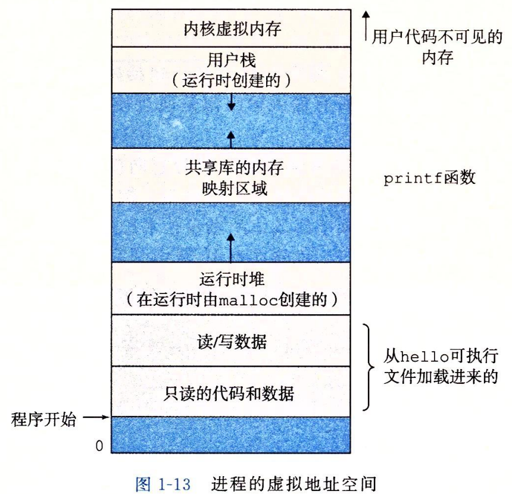
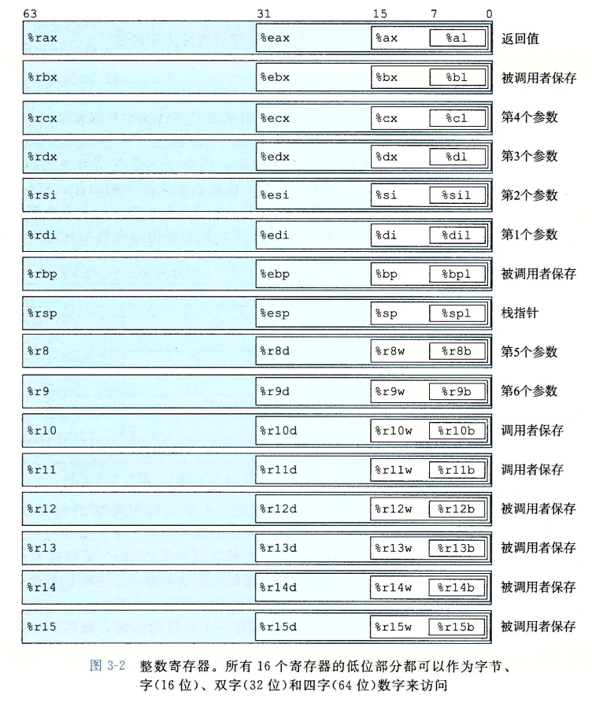
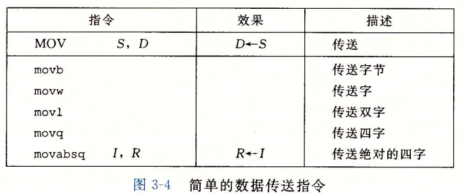

# 第一章:计算机系统漫游

### 进程
- **进程**是操作系统对一个正在运行的程序的一种抽象。在一个系统上可以同时运行多个进程，而每个进程都好像在独占地使用硬件。而**并发运行**，则是说一个进程的指令和另一个进程的指令是交错执行的。操作系统实现这种交错执行的机制称为**上下文切换**。
- 从一个进程到另一个进程的转换是由操作系统内核(kernel)管理的。内核是操作系统代码常驻内存的部分。当应用程序需要操作系统的某些操作时，比如读写文件，它就执行一条特殊的**系统调用(system call)**指令，将控制权传递给内核。然后内核执行被请求的操作并返回应用程序。注意，内核不是一个独立的进程。相反，它是系统管理全部进程所有代码的数据结构的集合。

### 线程
- 一个进程可以由多个成为线程的执行单元组成，每个线程都运行在进程的上下文中，并共享同样的代码和全局数据。

### 虚拟内存
- **虚拟内存**是一个抽象概念，它为每个进程提供了一个假象，即每个进程都在独占地使用主存。每个进程看到的内存都是一致的，称为**虚拟地址空间**。
- 在Linux中，地址空间最上面的区域是保留给操作系统中的代码和数据的，这对所有进程来说都是一样。地址空间的底部区域存放用户进程定义的代码和数据。

# 第二章:信息的表示和处理

# 第三章 程序的机器级表示
- **程序计数器**(通常称为"PC", 在x86_64中用%rip表示)给出将要执行的下一条指令在内存中的地址。
- 程序内存用虚拟地址来寻址，在任意给定的时刻，只有有限的一部分虚拟地址被认为是合法的。例如，x86_64的虚拟地址是由64位的字来表示的，在目前的实现中，这些地址的高16位必须设置为0，所以一个地址实际上能够指定的是2^48或64TB范围内的一个字节。

## Intel汇编和ATT汇编格式区别:
- Intel代码省略了指示大小的后缀，我们看到的指令push和mov，而不是pushq和movq。
- Intel代码省略了寄存器名字前面的%符号，用的是rbx，而不是%rbx
- Intel代码用不同的方式来描述内存的位置，例如是QWORD PTR [rbx]，而不是(%rbx)。
- 在带有多个操作数的指令情况下，列出操作数的顺序相反。

## 数据格式
- 从16位体系结构扩展成32位的，Intel用术语**字(word)**表示16位数据类型，因此称32位数为**双字(double word)**，称64位数为**四字(quad word)**。
- 大多数gcc生成的汇编代码指令都有一个字符的后缀，表明操作数的大小，例如：数据传送指令有四个变种:movb(传字节)、movw(传送字)、movl(传送双字)和movq(传送四字)。后缀**l**用来表示双字，因为32位数被看成是**长字(long word)**。

## 访问信息
- 一个x86-64的中央处理器单元(CPU)包含一组16个存储64位值的**通用目的寄存器**。它们的名字都以%r开头。
- 最初8086中有8个16位的寄存器，即图3-2中的%ax到%bp。扩展到IA32架构时，这些寄存器也扩展成32位寄存器，标号从%eax到%ebp。扩展到x86-64后，原来的8个寄存器扩展成位64位，标号从%rax到%rbp。除此之外，还增加了8个新的寄存器，它们的标号是按照新的命名规则制定的:从%r8到%r15。

x86_64加了一条限制，传送指令的两个操作数不能都指向内存位置，将一个值从一个内存位置复制到另一个内存位置需要两条指令，第一条指令将源值加载到寄存器中，第二条指令将该寄存器值写入目的的位置。

### 内存越界引用和缓冲区溢出
- C对于数组引用不进行任何边界检查，而且局部变量和状态信息(例如保存的寄存器值和返回地址)都存放在栈中。这两种情况结合到一起就能导致严重的程序错误，对越界的数组元素的写操作会破坏存储在栈中的状态信息。当程序使用这个被破坏的状态，试图重新加载寄存器或执行ret指令时，就会出现严重的错误。
- 一种常见的状态破坏就是**缓冲区溢出(buffer overflow)**。通常，在栈中分配某个字符数组来保存一个字符串，但是字符串的长度超出了数组分配的空间。
- 缓冲区溢出的一个更加致命的使用就是让程序执行它本来不愿意执行的函数，这是一种常见的通过计算机网络攻击系统安全的方法。通常，输入给程序的一个字符串，这个字符串包含一些可执行代码的字节编码，称为**攻击代码**，另外还有一些字节会用一个指向攻击代码的指针覆盖返回地址。那么，执行ret指令的效果就是跳转到攻击代码。