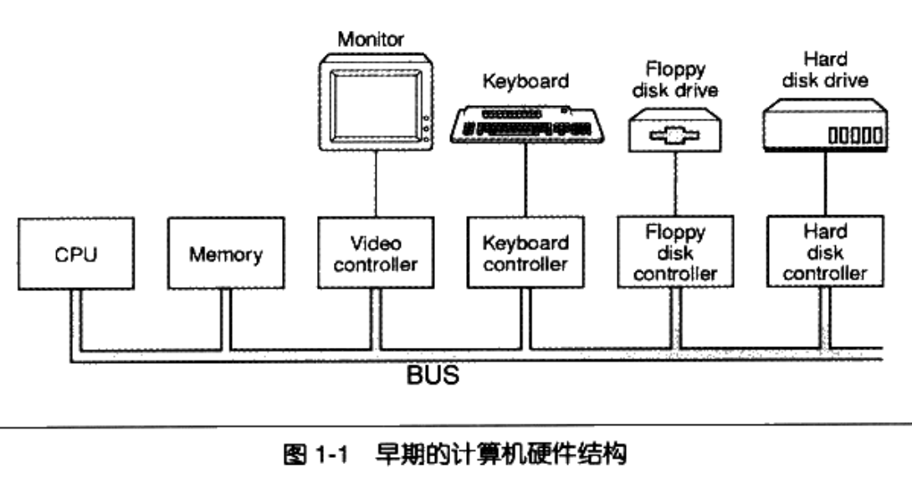
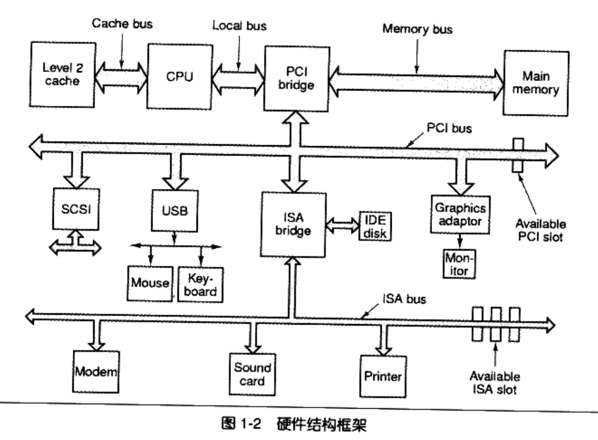
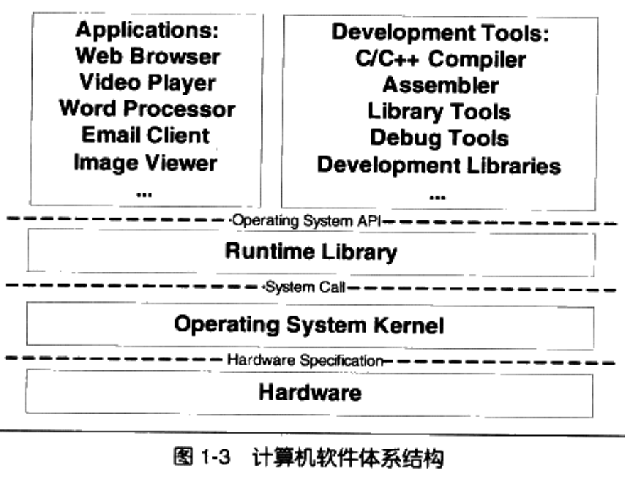
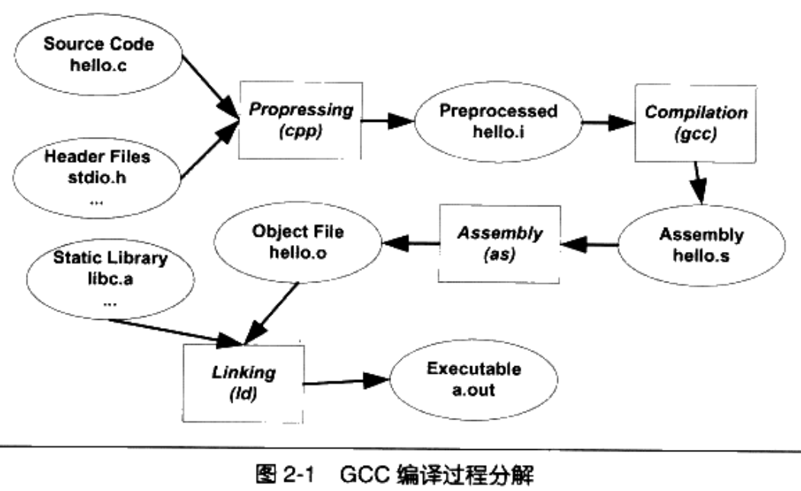
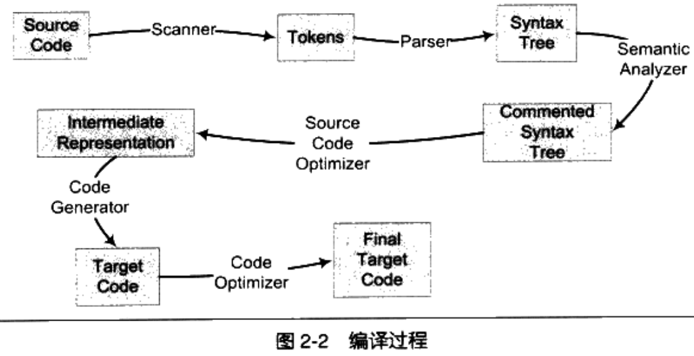

[目录]

[toc "float:left"]

### 计算机硬件发展介绍
- 早期的计算机没有很复杂的图形功能，CPU的核心频率也不高，跟内存的频率一样，他们都是直接连接在一个总线(bus)上的见图(1-1)。

- 后来由于CPU核心频率的提升，导致内存跟不上CPU的速度，于是产生了与内存频率一直的系统总线，而CPU采用倍频的方式与系统总线进行通信。为了协调CPU、内存和高速的图形设备，专门设计了一个高速的北桥芯片，以便他们之间能够高速地交换数据。
- 由于北桥运行的速度非常高，所以相对低速的设备如果全都直接连接在北桥上，北桥即须处理高速设备，又须处理低速设备，设计就会复杂，所以又专门设计处理低速设备的南桥芯片，磁盘、USB、键盘、鼠标等设备都连接在南桥上，由南桥将他们汇总后连接在北桥上，系统总线采用的是PCI结构，而低速设备上采用的ISA总线，见图1-2。

- 由于人们在制造CPU的工艺方面已经达到了物理极限，除非CPU制造工艺有本质的突破，否则CPU的频率将会一直被目前4GHz的"天花板"所限制。
- 人们开始想办法从另一个角度来提高CPU的速度，就是增加CPU的数量，其中最常见的一种形式就是对称多处理器(SMP, Symmetrical Multi-Processing)，理论上讲，增加CPU的数量就可以提高运算速度，并且速度的提高与CPU的数量成正比，但实际上并非如此，因为我们的程序并不是都能分解成若干个完全不相干的子问题。
- 图1-3 计算机软件体系结构

- 从整个层次结构上看，开发工具与应用程序是属于同一个层次的，因为他们都使用一个接口，那就是操作系统**应用程序编程接口**(Application Programming Interface)。比如Linux下的Glibc库提供POSIX的API；Windows的运行库提供Windows API，最常见的32位Windows提供的API又被称为Win32。
- 运行库使用操作系统提供的系统调用接口(System call Interface)，系统调用接口在实现中往往以软件中断(Software Interrupt)的方式提供，比如Linux使用0x80号中断作为系统调用接口。

###操作系统概念
- **多任务系统**：操作系统接管所有的硬件资源，并且本身运行在一个受硬件保护的级别。所有的应用程序都以**进程**的方式运行在比操作系统权限更低的级别，每个进程都有自己独立的地址空间，是的进程之间的地址空间相互隔离。CPU由操作系统进行分配，每个进程根据进程优先级的高低都有机会得到CPU，但是如果运行时间超出了一定的时间，操作系统会暂停该进程，将CPU资源分配给其他等待运行的进程，这种CPU的分配方式即所谓的抢占式，操作系统可以强行夺取CPU资源并且分配给它认为目前最需要的进程。
- **硬盘的结构**：硬盘的基本存储单位是扇区(Sector)，每个扇区一般为512字节，一个硬盘往往有多个盘片，每个盘片分两面，每面按照同心圆划分为若干个磁道，每个磁道划分为若干个扇区。
- **虚拟内存**
	- 分段(Segmentation)：基本思路是把一段与程序所需要的内存空间大小的虚拟空间映射到某个地址空间，这个映射过程由软件来设置，比如操作系统来设置这个映射函数，实际的地址转换由硬件完成。这样解决了地址隔离和程序重定位的问题。分段方法没有解决内存使用效率的问题，分段对内存区域的映射还是按照程序为单位，如果内存不足，被换入换出到磁盘的都是整个程序，这样必造成大量的磁盘访问操作，实际上，根据程序的局部性原理，当一个程序在运行时，在某个时间段内，它只是频繁地用到了一小部分数据，也就是说，程序的很多数据其实在一个时间段内都不会被用到的。
	- 分页(Paging):基本方法是把地址空间分成固定大小的页，每一页的大小由硬件决定，一般都是按照4K的页大小划分。
- **线程(Thread)**：一个标准的线程由线程ID、当前指令指针(PC)、寄存器集合和堆栈组成，一个进程由一个到多个线程组成，各个线程之间共享程序的内存空间(包括代码段、数据段、堆等)及一些进程级的资源(如打开文件和信号)。
- **可抢占线程和不可抢占线程**：线程在用尽时间片之后会被强制剥夺继续执行的权利，而进入就绪状态，这个过程叫做抢占(Preemption)，即之后执行的别的线程抢占了当前线程，对于不可抢占线程，线程必须主动进入就绪状态，而不是靠时间片用尽来被强制进入。如果线程始终拒绝进入就绪状态，并且也不进行任何的等待操作，那么其他的线程就永远无法执行。在不可抢占线程中，线程主动放弃执行无非两种情况：
	- 当线程试图等待某事件时(I/O等)。
	- 线程主动放弃时间片。
- Linux的多线程：在Linux内核中并不存在真正意义上的线程概念。Linux将所有的执行实体(无论是线程还是进程)都称为任务(Task)，每个任务概念上都类似于一个单线程的进程，具有内存空间、执行实体、文件资源等，不过Linux不用的任务之间可以选择共享内存空间，因而在实际意义上，共享了同一个内存空间的多个任务构成了一个进程，这些任务也就成了这个进程里的线程。
- fork：fork产生新任务的速度非常快，因为fork并不复制原任务的内存空间，而是和原任务一起共享一个写时复制(Copy on Write)的内存空间，指的是两个任务可以同时自由地读取内存，但任意一个任务试图对内存进行修改时，内存就会复制一份提供给修改方单独使用，以免影响其他的任务使用。

###编译和链接

####预编译
- 源文件和头文件被预编译器cpp预编译成一个.i文件，对于C++程序预编译后的文件扩展名是.ii
	- $gcc -E hello.c -o hello.i 或者
	- $cpp hello.c > hello.i
- 预编译过程主要处理那些源代码文件中的以"**#**"开始的预编译指令，比如#**include #define**等，处理规则如下：
	- 将所有的**#define**删除，并且展开所有的宏定义。
	- 处理所有条件预编译指令，比如：**#if、#ifdef、#elif、#else、#endif**。
	- 处理**#include**预编译指令，将被包含的文件插入到该预编译指令的位置。注意，这个过程是递归进行的，也就是说被包含的文件可能还包含其他文件。
	- 删除所有的注释。
	- 添加行号和文件名标识，以便于编译时编译器产生调试用的行号信息及编译时产生编译错误或警告时能够显示行号。
	- 保留所有的#pragram编译器指令，因为编译器需要使用它们。
	
#### 编译
- 编译过程就是把预处理完的文件进行一系列词法分析、语法分析、语义分析及优化后生产相应的汇编代码文件。
	- gcc -S hello.c -o hello.s或者
	- /usr/lib/gcc/i486-linux-gnu/4.1/cc1 hello.c
- 都可以得到汇编输出文件hello.s，gcc这个命令只是这些后台程序的包装，它会根据不同的参数要求调用预编译编译程序cc1、汇编器as、连接器ld。

#### 汇编
- 汇编器是将汇编代码转变为机器可以执行的指令。
	- $as hello.s -o hello.o 或者
	- $gcc -c hello.c -o hello.o

#### 编译过程
- 编译过程一般可以分为6步：扫描、语法分析、语义分析、源代码优化、代码生产和目标代码优化。

##### 词法分析
- 首先源代码程序被输入到扫描器(Scanner)，只是简单地进行词法分析。
- 有一个叫做lex的程序可以实现词法扫描。

##### 语法分析
- 语法分析器将对由扫描器产生的记号进行语法分析，从而产生语法树，由语法分析器生产的语法树就是以**表达式**为节点的树。
- 语法分析也有一个现成的工具叫做yacc。

##### 语义分析
- 编译器所能分析的语义是静态语义，所谓静态语义是指在编译期可以确定的语义，与子对应的动态语义就是只有在运行期才能确定的语义。
- 经过语义分析阶段以后，整个语法树的表达式都被标识了类型。

##### 中间语言生产
- 现代的编译期有着很多层次的优化，往往在源码级别会有一个优化过程。直接在语法树上优化比较困难，所以源代码优化器往往将整个语法树转换成中间代码，它是语法树的顺序表示，中间代码有很多类型，比较常见的有:**三地址码**和**P-代码**
- 三地址码表示方法：
	- x = y op z
	- 这个三地址码表示将变量y和z进行op操作以后，赋值给x。三地址码语句里面有三个变量地址。

#### 链接
- 链接过程主要包括了**地址和空间分配**、**符号绑定**和**重定位**。

#### 目标文件
##### 目标文件的格式
- 现在PC平台流行的可执行文件格式主要是Windows下的PE(portable Executable)和Linux的ELF(executable Linkable Format)，他们都是COFF(common file format)格式的变种。
- 为了防止符号名冲突，Linux的C语义规定，C语义源代码文件中的所有全局变量和函数经过编译以后，相对应的符号名前加上下划线**"_"**，而Fortran语义的源代码经过编译以后，所有的符号名前加上**"_"**，后面也加上**"_"**。C++设计考虑到了这个问题，增加了名称空间的方法来解决多模块的符号冲突问题。
- GCC 编译器可以通过参数项**"-fleading-underscore"**或者**"-fno-leading-underscore"**来打开和关闭是否在C语言符号前家上下划线。